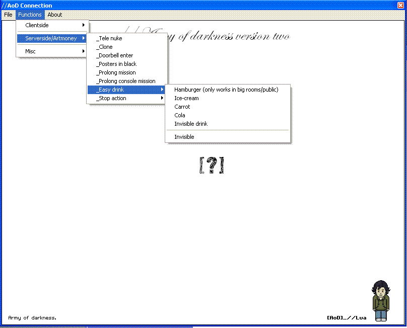



## AoD v2 \(Habbo scripting application\)

### Description

A nice scripting application, with a working v9 connection. Some of the features you need artmoney to work (eg. A_ to AP). Enjoy and play around with the features!

(Thanks to habbo whack for module coding)
 
### More Info
 

             |
---                |---
**Submitted On**   |2006-08-12 22:30:20
**By**             |[Lua](https://github.com/Planet-Source-Code/PSCIndex/blob/master/ByAuthor/lua.md)
**Level**          |Intermediate
**User Rating**    |5.0 (10 globes from 2 users)
**Compatibility**  |VB 6\.0
**Category**       |[Complete Applications](https://github.com/Planet-Source-Code/PSCIndex/blob/master/ByCategory/complete-applications__1-27.md)
**World**          |[Visual Basic](https://github.com/Planet-Source-Code/PSCIndex/blob/master/ByWorld/visual-basic.md)
**Archive File**   |[AoD\_v2\_\(Ha2014418182006\.zip](https://github.com/Planet-Source-Code/lua-aod-v2-habbo-scripting-application__1-66317/archive/master.zip)

